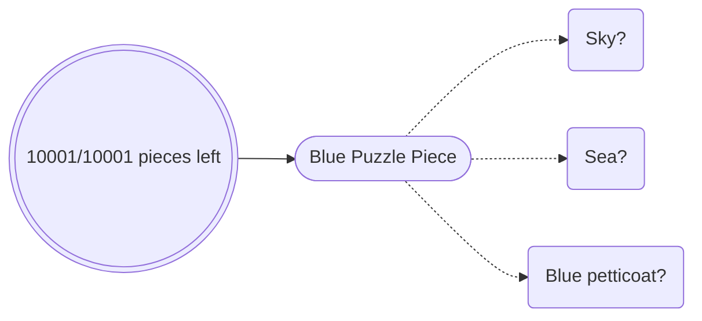
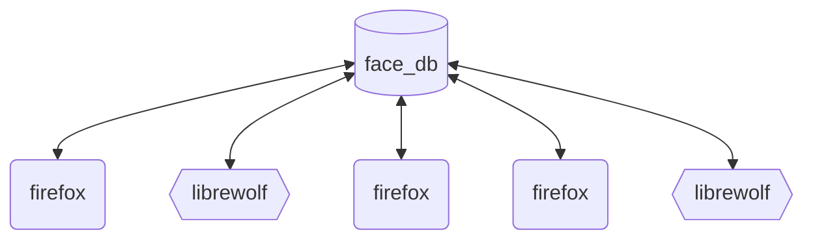
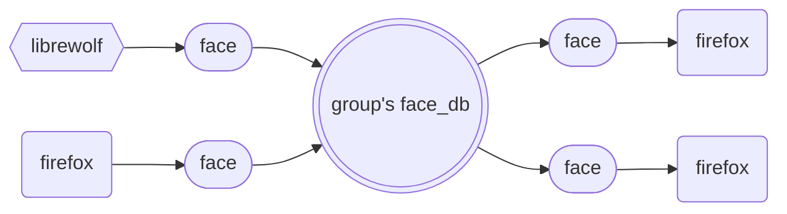

# lineup
recognition of faces for the web

## Demo 

## Why

Puzzle pieces ask us to recognise from reference:

To reduce the Δtime it takes to build up references, machine learning libraries can be used.

As PJ Vogt's [Search Engine podcast](https://podcasts.apple.com/gb/podcast/should-this-creepy-search-engine-exist/id1614253637?i=1000655151849) discusses, this is possible for faces.

## Mechanism

Using face-recognition to build up the reference list in a database, the lineup browser extension can allow for all faces found while browsing to later be checked. 

This software uncouples the browsing and the reference list.

Multiple people, on different browsers, can share the same database of references.

# Installation Requirements & Usage

#### Requirements - Python & Database
1. Install [Elasticsearch](https://www.elastic.co/guide/en/elasticsearch/reference/current/install-elasticsearch.html#elasticsearch-install-packages)
2. After installing elasticsearch: Edit *$elasticsearch-home/config/elasticsearch.yaml* and set  
   `xpack.security.enabled: false`

#### Installation - Client Side
1. Clone this repo
2. run `python3 -m pip install -r $repo/lineup_svr/requirements.txt`
  
## Usage
1. launch elasticsearch instance, wait until the output about 'health'
2. launch *$repo/lineup_svr/app.py* using `python3 app.py`
3. launch firefox, go to [about:debugging](about:debugging)
4. select `This Browser`, then `load temporary extension`
5. selecting *$repo/lineup_ext/manifest.json*

# Licensing

## Open Source License
This software is available under the [MIT License](LICENSE) for non-commercial use. This means individuals and organizations using the software without a commercial purpose can do so freely, with no cost, subject to the terms of the MIT License.

## Commercial use
This software is especially tailored to implement tracable security. A secure commercial version is also available.

Organisations wishing to use this software for commercial purposes should contact us to obtain a Commercial License.
