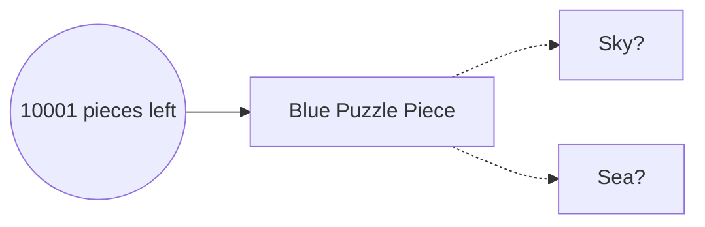
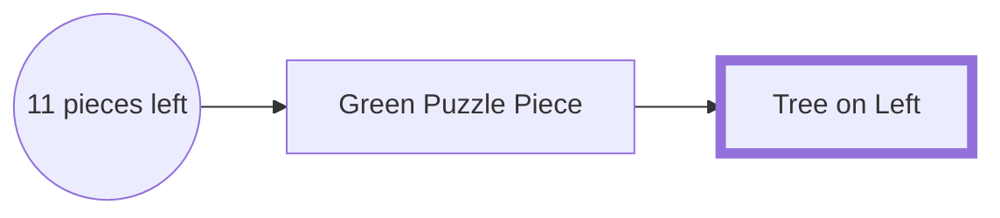

# lineup
face database in browsers

## Aim

Puzzle pieces ask us to recognise from reference:

We can reduce the time it takes to build up a whole series of references - we can offload that to a computer.

We can definitely do this for faces, as spoken about on the [Search Engine postcast](https://podcasts.apple.com/gb/podcast/should-this-creepy-search-engine-exist/id1614253637?i=1000655151849)

## Mechanism

Using Deepface to build up the reference list, an extension can allow for all faces recognised while browsing to be stored somewhere, then checked. 

This software decouples the browsing from the references.

Multiple people, on different browsers, can share the same database of references.

