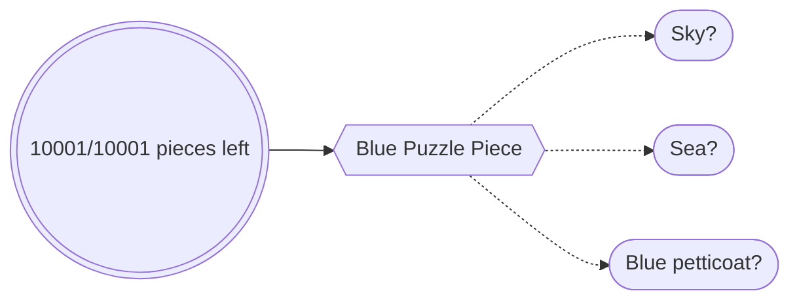
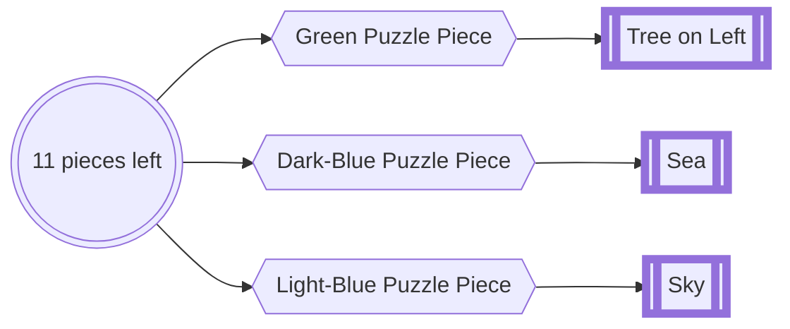
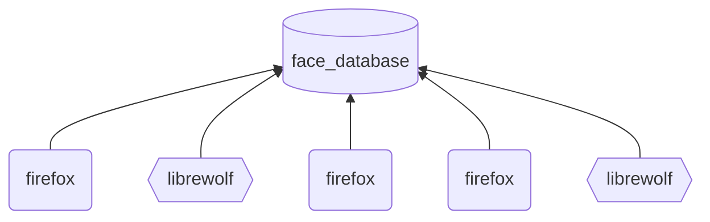

# lineup
face database when browsing

## Aim

Puzzle pieces ask us to recognise from reference:

We can reduce the Δtime it takes to build up a whole series of references, using machine learning.

We can definitely do this for faces, as PJ Vogt's [Search Engine postcast](https://podcasts.apple.com/gb/podcast/should-this-creepy-search-engine-exist/id1614253637?i=1000655151849) discusses

## Mechanism

Using Deepface to build up the reference list in Elasticsearch, a browser extension can allow for all faces recognised while browsing to be stored somewhere, then checked. 

This software decouples the browsing from the references.

Multiple people, on different browsers, can share the same database of references.

## Installation in 5 steps

0. Install [Elasticsearch](https://www.elastic.co/guide/en/elasticsearch/reference/current/install-elasticsearch.html#elasticsearch-install-packages)
1. Clone this repo
2. Add your Elasticsearch credentials into $cloned-repo/lineup-svr/env_dials.py OR set *"xpack.security.enabled = False"* in elasticsearch/config
3. run *"pip install -r $cloned-repo/lineup-svr/requirements.txt"*
4. in your gecko-based browser (firefox/librewolf), go to about:debugging, on the left select *"This Browser"* then *"load temporary extension"* and select *$cloned-repo/lineup-ext/manifest.json*

## Demo 

