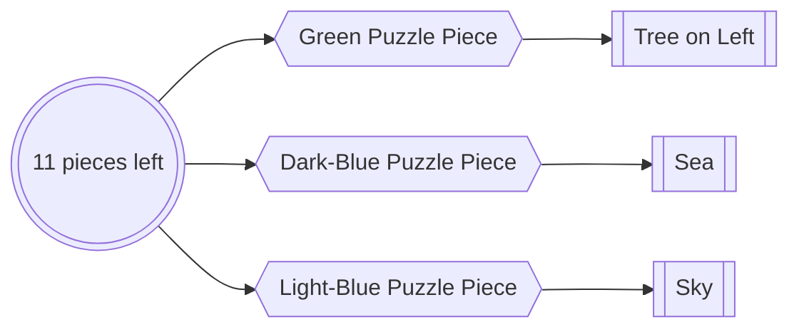
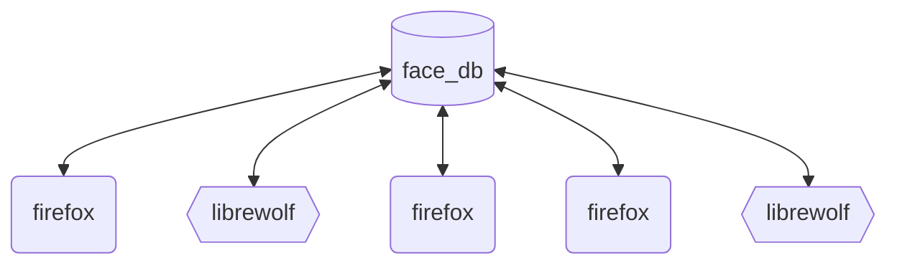

# lineup
face database when browsing

## Demo 

## Aim

Puzzle pieces ask us to recognise from reference:

Machine learning gives up some ways to reduce the Δtime it takes to build up references.

As PJ Vogt's [Search Engine podcast](https://podcasts.apple.com/gb/podcast/should-this-creepy-search-engine-exist/id1614253637?i=1000655151849) discusses, this is possible for faces.

## Mechanism

Using face-recognition to build up the reference list in a database, the lineup browser extension can allow for all faces found while browsing to later be checked. 

This software uncouples the browsing and the reference list.

Multiple people, on different browsers, can share the same database of references.

## Installation

0. Install [Elasticsearch](https://www.elastic.co/guide/en/elasticsearch/reference/current/install-elasticsearch.html#elasticsearch-install-packages)
1. Clone this repo
- 2(Choice A). Add your Elasticsearch credentials into $cloned-repo/lineup-svr/env_dials.py
- 2(Choice B). set *"xpack.security.enabled = False"* in elasticsearch/config
3. run *"pip install -r $cloned-repo/lineup-svr/requirements.txt"*
4.
- a. in your gecko-based browser (firefox/librewolf)
- b. go to about:debugging
- c. on the left select *"This Browser"*
- d. *"load temporary extension"*
- e. select *$cloned-repo/lineup-ext/manifest.json*

## License

# Licensing Information

## Open Source License
This software is available under the [MIT License](https://github.com/198thread/lineup/blob/main/LICENSE) for non-commercial use. This means individuals and organizations using the software without a commercial purpose can do so freely, with no cost, subject to the terms of the MIT License.

## Commercial License
Organizations wishing to use this software for commercial purposes should contact us to obtain a Commercial License. The Commercial License includes provisions tailored for enterprise use, including support and warranty clauses that are not available under the Open Source License.

For more details on obtaining a Commercial License, please contact 198thread on GitHub
